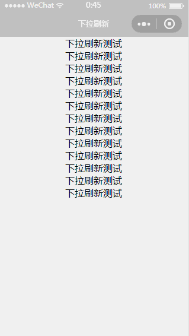
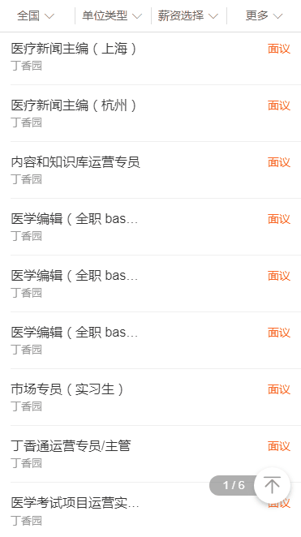
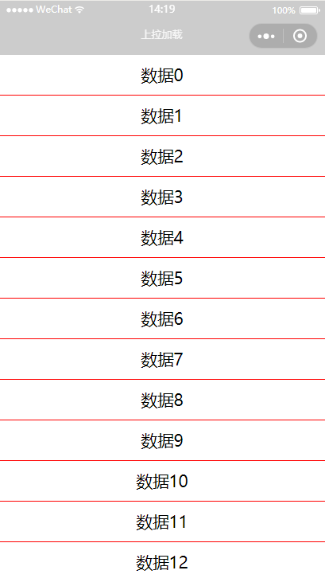
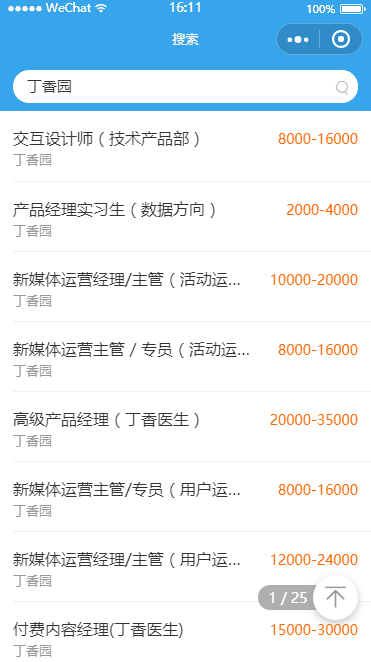

# 下拉刷新和上拉加载  
下拉刷新和上拉加载是业务上一个很常见的需求，在微信小程序里，提供了下拉刷新的方法 `onPullDownRefresh` 。而实现上拉加载相对来说就比较不方便了。
## 下拉刷新  
虽然微信的官方文档有很多坑，但上拉加载介绍的还是很全面的。在这里稍稍带过。
- 首先在全局 `config` 中的 `window` 配置 `enablePullDownRefresh` .
- 在 `Page` 中定义 `onPullDownRefresh` 钩子函数。到达下拉刷新条件后，该钩子函数执行，发起请求方法。
- 请求返回后，调用 `wx.stopPullDownRefresh` 停止下拉刷新。
### config
```javascript
config = {
    pages: [
      'pages/index'
    ],
    window: {
      backgroundTextStyle: 'light',
      navigationBarBackgroundColor: '#ccc',
      navigationBarTitleText: 'WeChat',
      navigationBarTextStyle: '#000',
      enablePullDownRefresh: true
    }
  }
```
### page
```javascript
onPullDownRefresh() {
  wepy.showNavigationBarLoading() 
  setTimeout(()=>{
    this.getData = '数据拿到了'
    wepy.stopPullDownRefresh()
    wepy.hideNavigationBarLoading()
    this.$apply()
  },3000)
}
```
效果如下：  
  
你会发现下拉的过程有些僵硬。这实际上是没有添加背景色的原因，加上背景色后再试试。  
  
现在感觉好多了吧。下拉刷新有现成的配置和方法，很容易实现，可上拉加载就不同了。  
## 上拉加载  
首先看一下要实现的效果，这是3g端的上拉加载。小程序要实现同样的效果。  
  
首先功能有  
- 点击回到顶部  这个很好实现，有对应的回到顶部函数
- 滑动屏幕记录当前页数  这个也很好实现，主要是监听滚动事件，判断对应滚动条高度，去计算其与子容器的高度即可。
- 上拉加载动画  
点击回到顶部，原生滚动自带全局函数  `wx.pageScrollTo(OBJECT)` 
上拉加载就没有官方提供的完整动画了，这里有两个实现的方案。一个是 `page` 自带的下拉触底钩子事件 `onReachBottom` 能做的只是下拉到底部的时候通知你触底了，一个是 `scroll-view` 标签自带事件。现在用两个方法分别实现一下上拉加载。
### 上拉触底事件 `onReachBottom`
模板
```html
<template>
  <view class="loading"></view>
  <view class="container"  
        @touchmove="moveFn" 
        @touchstart="startFn" 
        @touchend="endFn"
        style="transform:translate3d(0,{{childTop}}px,0)">
    <repeat for="{{list}}" 
            key="index" 
            index="index" 
            item="item">
        <view>{{ item }}<text>{{index}}</text></view>
    </repeat>
    </view>
</template>
```
钩子函数
```javascript
data = {
  getData: '',
  top: 0,
  lastTop: 0,
  canDrag: false,
  list: []
}
onReachBottom() {
 this.canDrag = true
}
methods = {
  moveFn(ev) {
    let nowY = ev.changedTouches[0].clientY
    nowY = nowY-this.lastTop
    if(nowY > 0 )
      this.canDrag = false
    if( nowY<=0 && this.canDrag ) {
      this.top = nowY
    }
    if( -this.top>= this.maxTop  )
      this.top = -this.maxTop
  },
  startFn(ev) {
    this.lastTop = ev.changedTouches[0].clientY 
  },
  endFn() {
    if(this.top <= -this.maxTop) {
      this.text = "去请求数据了"
      setTimeout(()=>{
        this.text = "请求回来了"
        this.canDrag = false
        this.list.push(...["数据","数据","数据"])
        this.$apply()
        this.top = 0;
        return
      },1000)
    }
  },
  gotoTop() {
    wepy.pageScrollTo({
      scrollTop: 0
    })
  }
}
```
完成后看一下效果：  
  

### 滚动容器实现上拉加载  
scroll-view： 可滚动视图区域。  
它的具体用法不赘述，看官方文档就行了。这里提解决上述问题的方法即可。
- `bindscrolltolower` 类比原生全局钩子 `onReachBottom`   
模板
```html
<scroll-view    scroll-y 
                id="content"   
                @scroll="scroll"  
                @scrolltolower="lower" 
                scroll-top="{{gotoTopNum}}" 
                lower-threshold="100" 
                style="transform:translate3d(0,{{childTop}}px,0)">
    <view  class="sty-search" 
            @touchmove="moveContent" 
            @touchstart="startContent" 
            @touchend="endContent">...</view>
</scroll-view>
```  
以上就是最终的模板，你可能在想为什么这么复杂。虽然复杂，但每个属性都是有用的，当然这其中有几个坑在等着我们。  
首先节点分为滚动容器和子容器。  

Q：为什么滚动容器里嵌套一个子容器，并且将拖动的三个方法绑定在它上面。  
A：这是第一个坑，因为 `scroll-view` 容器不能绑定 `touchmove`   事件,那如果绑定了会怎么样呢？不会怎么样，事件钩子不会调用。（这个坑在官方文档查不出来，当时绑定了不调用，在社区找到了解决方法，就是将touchmove事件绑定到子容器）  
再来看代码
```javascript
methods = {
    async lower() {
      this.canDrag = true
    },
    scroll (ev) {
      this.scrollTop = ev.detail.scrollTop
      if (ev.detail.deltaY > 0) {
        this.canDrag = false
      } else {
        
      }
      let nowSet = this.documentHeight+this.scrollTop-this.contentHeader
      let num = Math.ceil(nowSet/this.listHeight) - 1
      num = Math.floor(num / this.pageBean.pageSize) + 1
      num = (num > this.pageBean.pageNo) ? this.pageBean.pageNo : num 
      if(num != this.page) {
        this.page = num
        this.$apply()
      }
    },
    startContent(ev) {
      this.lastTop = ev.changedTouches[0].clientY
      if(!this.documentHeight){
        this.documentHeight = wx.getSystemInfoSync().windowHeight
      }
      this.moveY = 0
      this.startScroll = this.scrollTop
      /* 这句是解决回到顶部的bug */
      if (this.gotoTopNum || this.gotoTopNum==0) { this.gotoTopNum = undefined }
    },
    moveContent (ev) {
      let {
        pageNo,
        pageSize,
        totalCount
      } = this.pageBean
      let nowY = ev.changedTouches[0].clientY
      nowY = nowY-this.lastTop
      if (this.canDrag && nowY) {
          this.state = 1;
          if (nowY <= -this.maxMove) {
            nowY = -this.maxMove
                this.state = 2
          }
          /* 数据到底部改变状态 */
          if (pageNo >= this.maxPage || pageNo * pageSize >= totalCount) {
            this.state = 0
          }
          if (nowY <= 0) {
            this.moveY = nowY
            this.childTop = nowY
          } 
      }
    },
    async endContent(ev) {
      let {
        pageNo,
        pageSize,
        totalCount
      } = this.pageBean
    
      if (this.childTop === -this.maxMove) {
        
        /* 状态 */
        if (pageNo >= this.maxPage || pageNo * pageSize >= totalCount) {
            this.state = 0
        } else {
          this.pageBean.pageNo++ 
          await this.fillData()
          this.page = this.pageBean.pageNo
          this.gotoTopNum = this.scrollTop + this.maxMove
          this.childTop = 0
          this.canDrag = false
          this.$apply()
        }
      }
      /* 如果没超过刷新高度则重置 */
      this.childTop = 0
    },
    gotoTop() {
      this.gotoTopNum = 0
    },
}

```  
Q： 为什么要在 `touchStart` 的时候 将 `gotoTopNum` 置为 `undefined`?  
A： 因为这个页面有一个回到顶部的功能，当回到顶部时，`gotoTopNum` 置为0，再次下翻时，虽然实际的 `scrollTop` 改变了，但是 `gotoTopNum`   还为0，再次点击回到顶部时，因为数据未改变，视图层就不会去更新。所以在 `touchStart` 的时候给 `gotoTopNum` 一个无效的值，再次点击回到顶部时，视图层也就更新了。  


  

## 原生滚动 OR scroll-view  

对比 | 原生滚动 | scroll-view  
---|---|---
性能 |  流畅 |  节点过多会明显卡顿 
滚动函数 | onPageScroll  | bindscroll  
回到顶部 | wepy.pageScrollTo(object) 默认有动画效果，且无法取消 | 设置节点属性 `scroll-top`  
坑点 | 暂时没有发现 | 1, 与 `enablePullDownRefresh` ， `ReachBottom`不能共存  2，不能绑定touchmove事件 3，不能触发双击bar栏回到顶部的“彩蛋”

## END...了吗......  

并没有。  
## 真机测试
实现的上拉加载在模拟器上跑的很流畅，不存在问题。可是。  
如果是苹果机的话（暂时测试iphone5 和 iPhone7），存在这样一个问题，上拉或下拉回弹效果，这个效果会影响上拉的距离。    
这个问题想了很久，目前不能优雅的解决。  
所以就找**产品经理修改了需求**，去掉了上拉动画效果

## 总结
1. 在微信小程序里操作节点是昂贵的，比在浏览器里操作还昂贵（这是通过比较上拉加载功能在3g端和微信小程序的流畅度得来的），在 1.4.0 版本发布之后，虽然给出了很多操作节点的方法，比如得到一个节点的宽高、或者通过 `id` 选择器得到一个节点。请尽量减少这些方法的调用频率(  `函数节流`  )或 缓存结果  
2. 动手之前先动脑！！！不然会走很多弯路...  

