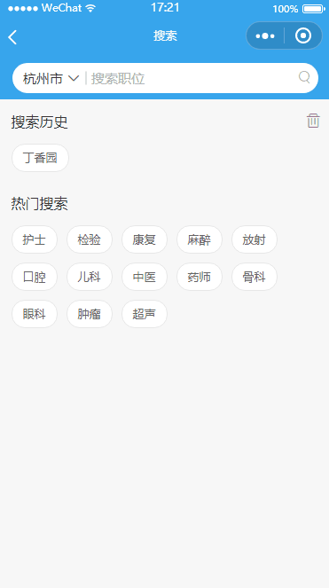

# wepy-cli 微信小程序组件化开发框架    
`wepy` 参考了 `vue.js` 的风格和语法特性，但在某些方面和 `VUE` 也有不同之处，如果稍稍不注意，就会浪费很多时间去调试、找出bug。在这里列举一些我们遇到的坑以及解决方法。这些坑有的是 `wepy` 引起的，有的是由微信开发者工具引起的，有的则是微信小程序自身的。也有的是几者同时造成的。我会在小标题注明坑的来源。  

## 很重要的微信开发者工具三条黄金法则  
### 明明没错，但开发者工具还是报错怎么办？？？
- 删掉 `dist` 目录。 
- 还不行？ 重启微信开发者工具。
- 还是报错？ 重启一下 `wepy` 项目
## WePY项目的目录结构

```
├── dist                   微信开发者工具指定的目录（该目录由WePY的build指令自动编译生成，请不要直接修改该目录下的文件）
├── node_modules           
├── src                    代码编写的目录（该目录为使用WePY后的开发目录）
|   ├── components         WePY组件目录（组件不属于完整页面，仅供完整页面或其他组件引用）
|   |   ├── com_a.wpy      可复用的WePY组件a
|   |   └── com_b.wpy      可复用的WePY组件b
|   ├── pages              WePY页面目录（属于完整页面）
|   |   ├── index.wpy      index页面（经build后，会在dist目录下的pages目录生成index.js、index.json、index.wxml和index.wxss文件）
|   |   └── other.wpy      other页面（经build后，会在dist目录下的pages目录生成other.js、other.json、other.wxml和other.wxss文件）
|   └── app.wpy            小程序配置项（全局数据、样式、声明钩子等；经build后，会在dist目录下生成app.js、app.json和app.wxss文件）
└── package.json           项目的package配置
```
- 在新建微信小程序的时候要选择工程目录，此时 `dist` 为小程序根目录，`wepy` 编译后的文件就打包在这个目录。
- `src` 中 每新建 `pages` 页面 就要在 `app.wpy` 中标明路由，也就创建了一个新的路由页面。`component` 为公用组件库。
- `app.wpy` 中配置全局信息，`pages` 内部页面配置各自局部信息。

## `WePy` 与 `Vue` 不同之处  
```
//index.wpy中的<script>部分

import wepy from 'wepy';

//通过继承自wepy.page的类创建页面逻辑
export default class Index extends wepy.page {
    //可用于页面模板绑定的数据
    data = {
        motto: 'Hello World',
        userInfo: {}
    };

    //事件处理函数(集中保存在methods对象中)
    methods = {
        bindViewTap () {
            console.log('button clicked');
        }
    };

    //页面的生命周期函数
    onLoad() {
        console.log('onLoad');
    };
}
```
### 全局钩子

钩子函数 | Vue | WePy| 功能
---|---|---|---|
beforeCreate| Y|N | \
beforeMount | Y|N|\
mounted     | Y|N|\
beforeUpdate| Y|N|\
updated     | Y|N|\
beforeDestroy| Y|N|\
destroyed |Y|N|\
onShow | N | Y | 页面显示时调用，执行顺序在onLoad之后，使用场景后面会介绍
onLoad | N | Y | 页面加载时调用，在这里可以拿到路由参数
### 全局属性
 属性 | Vue | WePy| 功能
---|---|---|---|
mixins | Y|Y | 基本相同，但 `WePy` 只混合data、components、events以及其它自定义方法，其他属性如 `computed` 不进行混合，如果父组件和 `mixins` 冲突（只要父组件定义了 `computed` ），则全部采用父组件的。
computed  | Y|Y|相同
watch   | Y|Y|相同
methods    | Y|Y| `WePy` 的methods只是钩子事件，如 `Tap` `touchend` ...而如果要自定义方法，写在methods同层级就可以了。
events    | N|Y| 通过$broadcast、$emit、$invoke所传递的事件的函数
data    | Y|Y| 在 `.vue` 文件内写作返回对象的函数，在 `.wpy` 直接写为对象即可,这样就有一个问题？思考为什么 `vue` 要写成返回对象的函数

## 细数遇到的坑  
- **善用 $apply**
- **使用repeat 的注意事项**
- **父组件二级参数传递**
- **mixins 混合功能有限**
- **wxParse OR richText**
- **微信文档里搜索不出来的路由栈**

### 善用 $apply `(wepy)`   
这个问题前期经常会用到，请求明明回来了，也修改了数据，但视图层就没没更新。最后在文档的最后面找到了原因。  
引用自 WePY 文档  
>WePY数据绑定方式
>WePY使用脏数据检查对setData进行封装，在函数运行周期结束时执行脏数据检查，一来可以不用关心页面多次setData是否会有性能上的问题，二来可以更加简洁去修改数据实现绑定，不用重复去写setData方法。代码如下：  
>```this.title = 'this is title';```

>但需注意，在函数运行周期之外的函数里去修改数据需要手动调用$apply方法。如：
>
>```
>setTimeout(() => {
>    this.title = 'this is title';
>    this.$apply();
>}, 3000);
>```
所以在生命周期外改变 `data` 的时候，需调用 `$apply` 方法重新检查数据。  
### 使用repeat 的注意事项  `(wepy)`  
 ***申明，WePy的维护者1.x版本不建议repeat中使用 `computed` 和 `props`***
#### 子组件拿不到父组件传入的二级属性  
### 父组件二级参数传递 `(wepy)`  

### mixins 混合功能有限  `(wepy)`
`mixins` 混合 `computed` 时，当父组件存在 `computed`，即使 `computed` 为空，`mixins` 内部的 `computed` 也会完全失效。因此在 `mixins` 内部慎用 `computed`。  
我们的做法是 mixins 最终在每个调用的组件里重写一份 `computed`。

### wxParse OR richText  
在微信小程序里会遇到填充后台返回的 富文本 需求，因为微信小程序里面无法动态填充节点，所以要实现这个需求还是有些麻烦。在小程序低版本(基础库 < 1.4.0),可以选择 `wxParse` 这个库。而现在可以选择 `richText ` 组件。  
首先可以看看 `wxParse` 支持什么标签。  
>wxParse
>## 特性

>| 支持特性        | 实验功能           | ToDo  |
>| ------------- |-------------| -----|
>| - [x] HTML的大部分标签解析 | [x] 小表情emjio | [x] table标签 |
>| - [x] 内联style          | [x] a标签跳转   |               |
>| - [x] 标签Class          | [x] 动态添加    |               |
>| - [x] 图片自适应规则       |               |                |
>| - [x] 图片多图片预览      |                |               |
>| - [x] 模版层级可扩展性    |                |               |
>| - [x] 多数据循环方式      |                |  |
>| - [x] 内联style         |                |   |
>|         |                |   |  
可以看到，暂时不支持 `table` 标签，如果你的富文本里包含table标签的话，不会被解析，而会被过滤掉。  
如果你想在 `WePy` 里使用 `wxParse` 的话，[戳这里](https://github.com/icindy/wxParse/issues/57)  
关于 `richText`也不过多赘述，官方文档讲的很清楚[戳这里](https://mp.weixin.qq.com/debug/wxadoc/dev/component/rich-text.html)，列举一下 `richText` 的痛点吧。  
调用形如：  

```<rich-text nodes="{{nodes}}" bindtap="tap"></rich-text>```  

其中 `nodes` 类型为 `Array` 或者 `String`, 并且推荐用 `Array`， `String` 不用解释，字符串模板，可为什么可以传入 `Array` 对象？  
原来即使你传入 模板字符串最终也会被转为 `Array` 对象的。其形如：  
```
nodes: [{
      name: 'div',
      attrs: {
        class: 'div_class',
        style: 'line-height: 60px; color: red;'
      },
      children: [{
        type: 'text',
        text: 'Hello&nbsp;World!'
      }]
    }]
```  
所以，这就对你的字符串模板严格起来，比如不能出现 未闭合标签，不能出现不支持的属性...总之你的标签必须是标准的，否则解析出来标签会失踪，甚至报错，导致 `rich-text` 内容为空。  
我们在实际开发中也遇到了后台返回的富文本不标准的问题，最后是写了正则表达式，过滤掉了一些不标准字符。  
```javascript
import wepy from 'wepy'

export default class HtmlFilterMixin extends wepy.mixin {
  htmlFilter(htmlStr) {
    return htmlStr.replace(/<(table|td|th)/ig, '<$1 class="$1"')
      .replace(/\s+(?:"|')[^<]*?(?=>)/ig, '')
      .replace(/(\n|\r\n)/g, '<br>')
  }
}
```  
**总结一下二者如何取舍，如果你的富文本里没有 `tabel` 标签，或者 `table` 标签不重要 ,如果你可以忍受 `wxParse` 包的大小(模板+js资源=138k)，那就可以用 `wxParse`。**
**如果你必须要填充 `table`,你的标签在可控范围内（能被正确解析成json），并且目标平台小程序基础库(>=1.4.0),那么你就可以用`rich-text`**
## 子页面返回传递参数给父页面（小程序）  
这个需求是从子页面返回父页面时，传值给父页面。效果如下：  
  
猜想解决方法：  
1. 在子页面使用 `navigateTo` 或者 `redirectTo` 这种跳转方法，带上传递的参数，在父页面 `onLoad` 的时候获取路由参数。这样显然是不行的。因为 `onLoad` 只会在创建之初调用一次，有子页面的时候父页面早就创建好了，所以 `onLoad` 就不会执行了。  
2. 全局 `state`，这种方法不好管理。  
3. 在翻遍了微信小程序文档后，也没找到解决方法，直到帖子里看见 `getCurrentPages` 方法。 `可通过 getCurrentPages()获取当前的页面栈`。  
### `getCurrentPages` 解决子页面传值父页面
如何做呢？首先看子页面：  
```
trunBack(ev) {
  let location = dataset.areaid
  let locationText = dataset.name
  let pages = getCurrentPages()
  let prevPage = pages[pages.length - 2] // 父页面
  prevPage.data.location = location
  prevPage.data.locationText = locationText
  wepy.navigateBack()
}
```
父页面：  
```
onShow() {
  let pages = getCurrentPages()
  let prevPage = pages[pages.length - 1]
  console.log(prevPage, this)
  if (prevPage) {
    // 重新赋值一次
    this.changeLocation(prevPage.data.location, prevPage.data.locationText)
  }
}
```  
在子页面获取到路由栈后，直接修改父页面内部的 `data`，发现视图没有更新，分别打印出路由栈里面的当前页面 和 当前 `this` ，发现路由栈里存储的对象并不是 `this`，因此在父页面又写了 `onShow` 钩子函数，取出路由栈属性，重新赋值一次。
